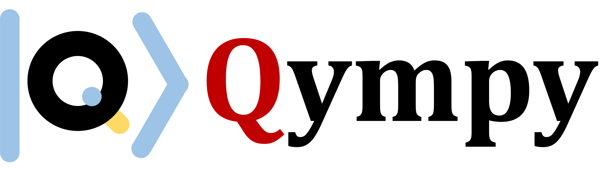
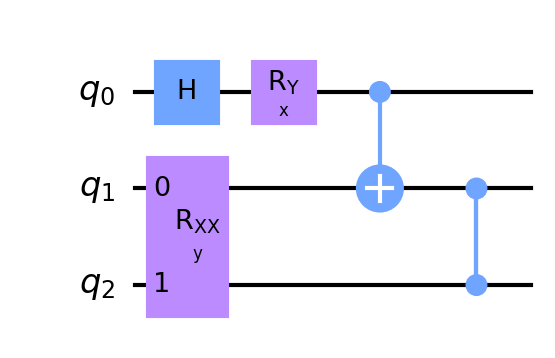

# Qympy - Quantum Analytic Computation with Sympy
A sympy based python package for symbolic calculation of quantum circuit and machine learning.
See GitHub: https://github.com/r08222011/Qympy

---

### Installation
Simply run `pip install`, see [Qympy](https://pypi.org/project/qympy/)

```bash
pip install qympy
```

### Get Started
See `qympy/example/example_circuit.ipynb`

**1. Circuit Initialization**
Common circuits ansatz can be found in `qympy.quantum_circuit`, mostly follow with [Qiskit.operations](https://qiskit.org/documentation/tutorials/circuits/3_summary_of_quantum_operations.html). To build a circuit from beginning, use `qympy.quantum_circuit.sp_circuit.Circuit`. The basic use of `Circuit` is same as [Qiskit](https://qiskit.org). For example:
```python
from qympy.quantum_circuit.sp_circuit import Circuit

qc = Circuit(3)   # initialize a 3-qubit quantum circuit
qc.h(0)           # Hadamard gate on 0th qubit
qc.ry("x", 0)     # y-rotation on 0th qubit with theta = x
qc.rxx("y", 1, 2) # xx-rotation on 1st and 2nd qubits with theta = y
qc.cx(0,1)        # CNOT on 1st and 2nd qubits
qc.cz(1,2)        # CZ on 1st and 2nd qubits
```

**2. Draw the circuit**
We now have initialized a quantum circuit. To see the circuit we built, we can use `Circuit.draw()`. This method use [qiskit.circuit.QuantumCircuit.draw](https://qiskit.org/documentation/stubs/qiskit.circuit.QuantumCircuit.draw.html) with `draw('mpl')` as default. For example:

```python
qc.draw("mpl")
```


**3. Evolve and measure the circuit**
The last step for getting the analytic expression is to call the method `Circuit.evolve()`. This will calculate the final state with the gates applied. After evolving the quantum state, we can measure the quantum state with *X*, *Y*, *Z* basis with a single certain qubit. For example:
```python
'''It would be a good habit to evolve the state first.
Although when using 'measure' qympy will automatically evolve if you haven't evolve.
We design in this way since we won't always need to know the final state for every case.'''

qc.evolve() # evolve the circuit
result = qc.measure(2, "Z") # measure the 2nd qubit in Z-basis
```

The result would be

```txt
                           2                                    2             
  ⎛        ⎛x⎞         ⎛x⎞⎞            ⎛        ⎛x⎞         ⎛x⎞⎞            ⎛ 
  ⎜  √2⋅sin⎜─⎟   √2⋅cos⎜─⎟⎟            ⎜  √2⋅sin⎜─⎟   √2⋅cos⎜─⎟⎟            ⎜√
  ⎜        ⎝2⎠         ⎝2⎠⎟     2⎛y⎞   ⎜        ⎝2⎠         ⎝2⎠⎟     2⎛y⎞   ⎜ 
- ⎜- ───────── + ─────────⎟ ⋅sin ⎜─⎟ + ⎜- ───────── + ─────────⎟ ⋅cos ⎜─⎟ - ⎜─
  ⎝      2           2    ⎠      ⎝2⎠   ⎝      2           2    ⎠      ⎝2⎠   ⎝ 

                     2                                  2        
     ⎛x⎞         ⎛x⎞⎞            ⎛      ⎛x⎞         ⎛x⎞⎞         
2⋅sin⎜─⎟   √2⋅cos⎜─⎟⎟            ⎜√2⋅sin⎜─⎟   √2⋅cos⎜─⎟⎟         
     ⎝2⎠         ⎝2⎠⎟     2⎛y⎞   ⎜      ⎝2⎠         ⎝2⎠⎟     2⎛y⎞
──────── + ─────────⎟ ⋅sin ⎜─⎟ + ⎜───────── + ─────────⎟ ⋅cos ⎜─⎟
   2           2    ⎠      ⎝2⎠   ⎝    2           2    ⎠      ⎝2⎠
```

### Quantum Machine Learning
See `qympy/example/example_ml.ipynb`

In this section, we demonstrate how to use symbolic expression to calculate machine learning, including classical and quantum machine learning, also hybrid. We use a very simple hybrid model with 2-dimensional input data for example.

**1. Contruct a hybrid model**
We construct a hybrid model with a `Linear` layer followed by a quantum circuit, which is constructed with `AngleEncoding` and `SingleRot`, and finally end up with a `Measurement`.

```python
import sympy as sp
from qympy.quantum_circuit.sp_circuit import Circuit
from qympy.machine_learning.classical import Linear
from qympy.machine_learning.quantum import Measurement, AngleEncoding, SingleRot

class HybridModel:
    def __init__(self, input_dim):
        self.net = [
            Linear(input_dim, input_dim),
            AngleEncoding(input_dim, rot_gate="ry") + SingleRot(input_dim, rot_mode=['rz'], ent_mode='cx'),
            Measurement(qubits=[0], bases=["Z"]),
        ]
    def __call__(self, x):
        for submodel in self.net:
            x = submodel(x)
        return x
```

**2. Feed forward the input data**
We then feed forward a 2-dimensional data `x = [x0, x1]`

```python
# initialize input variables: x0 and x1
x0 = sp.Symbol("x0", real=True)
x1 = sp.Symbol("x1", real=True)
x  = sp.Matrix([x0, x1])

# create a hybrid model
input_dim = len(x)
model = HybridModel(input_dim)
result = model(x)[0]
```

The result would be

```txt
     2⎛L¹₀   L¹₁⋅x₀   L¹₂⋅x₁⎞    2⎛L²₀   L²₁⋅x₀   L²₂⋅x₁⎞      2⎛L¹₀   L¹₁⋅x₀ 
- sin ⎜─── + ────── + ──────⎟⋅sin ⎜─── + ────── + ──────⎟ - sin ⎜─── + ────── 
      ⎝ 2      2        2   ⎠     ⎝ 2      2        2   ⎠       ⎝ 2      2    

  L¹₂⋅x₁⎞    2⎛L²₀   L²₁⋅x₀   L²₂⋅x₁⎞      2⎛L²₀   L²₁⋅x₀   L²₂⋅x₁⎞    2⎛L¹₀  
+ ──────⎟⋅cos ⎜─── + ────── + ──────⎟ + sin ⎜─── + ────── + ──────⎟⋅cos ⎜─── +
    2   ⎠     ⎝ 2      2        2   ⎠       ⎝ 2      2        2   ⎠     ⎝ 2   

 L¹₁⋅x₀   L¹₂⋅x₁⎞      2⎛L¹₀   L¹₁⋅x₀   L¹₂⋅x₁⎞    2⎛L²₀   L²₁⋅x₀   L²₂⋅x₁⎞
 ────── + ──────⎟ + cos ⎜─── + ────── + ──────⎟⋅cos ⎜─── + ────── + ──────⎟
   2        2   ⎠       ⎝ 2      2        2   ⎠     ⎝ 2      2        2   ⎠
```