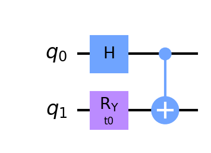

# Qympy - Quantum Analytic Computation with Sympy
A sympy based python package for calculating the analytical expression of qubits' quantum state.

---

### Get Started

##### - Circuit Initialization
Common circuits ansatz can be found in `circuit.ansatz`. To build a circuit from beginning, use `circuit.Circuit`. The basic use of `circuit.Circuit` is same as [Qiskit](https://qiskit.org). For example:
```python3
>>> from circuit import Circuit

>>> num_qubits = 2  # Number of qubits in the circuit
>>> qc = Circuit(2) # Initialize a two-qubit circuit
>>> qc.h(0)         # Apply Hadamard Gate at qubit 0
>>> qc.cx(0,1)      # Apply CNOT gate with control 0 and target 1
```

##### - Draw the circuit
We now have initialized a quantum circuit. To see the circuit we built, we can use `Circuit.draw()`. This method use [qiskit.circuit.QuantumCircuit.draw](https://qiskit.org/documentation/stubs/qiskit.circuit.QuantumCircuit.draw.html) with `draw('mpl')` as default. For example:
```python3
>>> qc.draw("mpl")
```


##### - Evolve the circuit
The last step for getting the analytic expression is to call the method `Circuit.evolve_state()`. This will calculate the final state with the gates applied. After evolving the quantum state, we can measure the quantum state with *X*, *Y*, *Z* basis with a single certain qubit. For example:
```python3
>>> qc.evolve_state()
>>> qc.measure(0, "X")
>>> sp.latex(qc.measure(0, "X"))
'2 \\sin{\\left(\\frac{t_{0}}{2} \\right)} \\cos{\\left(\\frac{t_{0}}{2} \\right)}'
```
Note, you can see the prettier expression with [jupyter](https://jupyter.org).