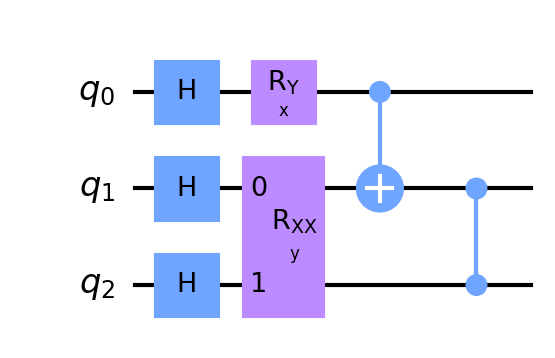

# Qympy - Quantum Analytic Computation with Sympy
A sympy based python package for symbolic calculation of $n$-qubit quantum state.
See GitHub: https://github.com/r08222011/Qympy

---

### Installation
Simply run, see [Qympy](https://pypi.org/project/qympy/)
```bash
pip install qympy
```

### Get Started

**1. Circuit Initialization**
Common circuits ansatz can be found in `/src/qympy/quantum_circuit`. To build a circuit from beginning, use `sp_circuit.Circuit`. The basic use of `Circuit` is same as [Qiskit](https://qiskit.org). For example:
```python3
from qympy.quantum_circuit.sp_circuit import Circuit

qc = Circuit(3)   # initialize a 3-qubit quantum circuit
qc.h(0)           # Hadamard gate on 0th qubit
qc.ry("x", 0)     # y-rotation on 0th qubit with theta = x
qc.rxx("y", 1, 2) # xx-rotation on 1st and 2nd qubits with theta = y
qc.cx(0,1)        # CNOT on 1st and 2nd qubits
qc.cz(1,2)        # CZ on 1st and 2nd qubits
```

**2. Draw the circuit**
We now have initialized a quantum circuit. To see the circuit we built, we can use `Circuit.draw()`. This method use [qiskit.circuit.QuantumCircuit.draw](https://qiskit.org/documentation/stubs/qiskit.circuit.QuantumCircuit.draw.html) with `draw('mpl')` as default. For example:
```python3
qc.draw("mpl")
```


**3. Evolve and measure the circuit**
The last step for getting the analytic expression is to call the method `Circuit.evolve_state()`. This will calculate the final state with the gates applied. After evolving the quantum state, we can measure the quantum state with *X*, *Y*, *Z* basis with a single certain qubit. For example:
```python3
qc.evolve()
print(sp.latex(qc.measure(2, "Z")))
qc.measure(2, "Z")
```
Note, you can see the prettier expression with [jupyter](https://jupyter.org).

---

### License

MIT License

Copyright (c) 2022 Yi-An Chen

Permission is hereby granted, free of charge, to any person obtaining a copy
of this software and associated documentation files (the "Software"), to deal
in the Software without restriction, including without limitation the rights
to use, copy, modify, merge, publish, distribute, sublicense, and/or sell
copies of the Software, and to permit persons to whom the Software is
furnished to do so, subject to the following conditions:

The above copyright notice and this permission notice shall be included in all
copies or substantial portions of the Software.

THE SOFTWARE IS PROVIDED "AS IS", WITHOUT WARRANTY OF ANY KIND, EXPRESS OR
IMPLIED, INCLUDING BUT NOT LIMITED TO THE WARRANTIES OF MERCHANTABILITY,
FITNESS FOR A PARTICULAR PURPOSE AND NONINFRINGEMENT. IN NO EVENT SHALL THE
AUTHORS OR COPYRIGHT HOLDERS BE LIABLE FOR ANY CLAIM, DAMAGES OR OTHER
LIABILITY, WHETHER IN AN ACTION OF CONTRACT, TORT OR OTHERWISE, ARISING FROM,
OUT OF OR IN CONNECTION WITH THE SOFTWARE OR THE USE OR OTHER DEALINGS IN THE
SOFTWARE.